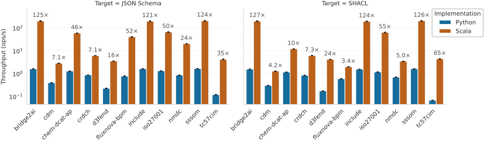
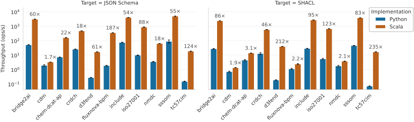

# Benchmarks

We benchmarked LinkML-Scala against the reference [`linkml` Python package](https://github.com/linkml/linkml) by measuring the **throughput** (generations per second) of the SHACL and JSON Schema generators.

> [!TIP]
> **TL;DR:**
> Across a diverse set of 11 real-world schemas, LinkML-Scala was faster than LinkML (Python) in every tested scenario – on average by **22.9–38.5×**, depending on the generator and scenario.

## Methodology

The benchmarks emulate two different usage patterns:

- **Cold start** – end-to-end generation invoked from the CLI. This emulates a workflow typical for CI scripts and interactive schema authoring, where the process starts, generates once, and exits.
- **Warm** – the generator runs repeatedly in a loop inside an interpreter/JIT. This emulates a persistent server application.

### Setup

- **Implementations:** LinkML-Scala 0.9.3 and LinkML (Python) 1.11.1.
- **Runtimes:** OpenJDK 25.0.2+10-LTS and CPython 3.14.6 (unless otherwise stated).
- **Test bench:** Intel Core Ultra 9 285K (3.7 GHz, boost 5.7 GHz), 64 GB DDR5-6400, Ubuntu Desktop 24.04 (Linux 6.14).
- **Cold-start harness:** the [hyperfine](https://github.com/sharkdp/hyperfine) CLI tool, driving the LinkML-Scala native binary (Oracle GraalVM Native Image 25.0.1+8.1) and the default LinkML (Python) CLI script.
- **Warm harness:** the [Java Microbenchmark Harness (JMH)](https://github.com/openjdk/jmh) for LinkML-Scala and a plain Python script for LinkML (Python). Both implementations parse schemas and resolve imports in a set-up phase, so all models are in memory before measurement. Each scenario ran 5 warm-up + 10 measurement runs across 5 forks.

[Benchmark code and scripts](https://github.com/NeverBlink-OSS/linkml-scala/tree/dbd4d1eccfad3952c8e8887ebae5a527fed2cb79/benchmark).

### Datasets

We collected 11 diverse LinkML schemas by browsing the [LinkML Schema Registry](https://linkml.io/linkml-registry/registry/) and public GitHub repositories. They span domains such as cybersecurity (`d3fend`, `iso27001`), finance (`cdm`), biology (`nmdc`, `crdch`, `include`), and energy (`tc57cim`). Several schemas required minor manual repairs (missing prefixes, invalid URIs). The full dataset is
published at [NeverBlink-labs/linkml-benchmark-schemas](https://github.com/NeverBlink-labs/linkml-benchmark-schemas/tree/8411b34af6517f22cc91c543991a3bae669567cd).

*Classes* and *Attributes* are the materialized (induced) totals.

| Schema    | Files | Size (KiB) | Classes | Attributes |
|-----------|------:|-----------:|--------:|-----------:|
| bridge2ai |     1 |       39.5 |      38 |        160 |
| cdm       |    37 |     2237.9 |     779 |       3245 |
| chem-dcat |     5 |      117.4 |      89 |        889 |
| crdch     |     1 |     1064.8 |      41 |        335 |
| d3fend    |     1 |     2591.3 |    4366 |       5250 |
| fluxnova  |    17 |      244.3 |     258 |       2765 |
| include   |     1 |       56.3 |      10 |        149 |
| iso27001  |     1 |      251.7 |      35 |        781 |
| nmdc      |    14 |      558.8 |      80 |       1655 |
| sssom     |     1 |       59.4 |       9 |        110 |
| tc57cim   |     1 |     2952.3 |    1528 |      34172 |

## Results

### Cold start

### Warm

### Summary

We define *speedup* as the ratio of LinkML-Scala's throughput to LinkML (Python)'s throughput. The geometric mean speedup was:

| Scenario   | JSON Schema |     SHACL |
|------------|------------:|----------:|
| Cold start |   **36.5×** | **22.9×** |
| Warm       |   **38.5×** | **26.8×** |

LinkML-Scala was faster than LinkML (Python) in every tested scenario.

## Discussion and limitations

The speedup is far from uniform across datasets – in the warm JSON Schema benchmark it ranges from **1.7× to 187×** (two orders of magnitude). These differences may stem from uneven feature coverage between the implementations, unoptimized code paths in LinkML-Scala, or very text-heavy (hard-to-optimize) schemas. We plan to investigate these outliers in follow-up work.

For small datasets in the cold-start scenario, LinkML-Scala is mainly limited by the startup time of its GraalVM-compiled binary (~2.5 ms on a modern Linux machine). Some schemas (e.g., `sssom`) were generated in only ~5 ms, making startup roughly half of the elapsed time.

---

**Benchmark code and datasets:**
[NeverBlink-labs/linkml-benchmark-schemas](https://github.com/NeverBlink-labs/linkml-benchmark-schemas)
